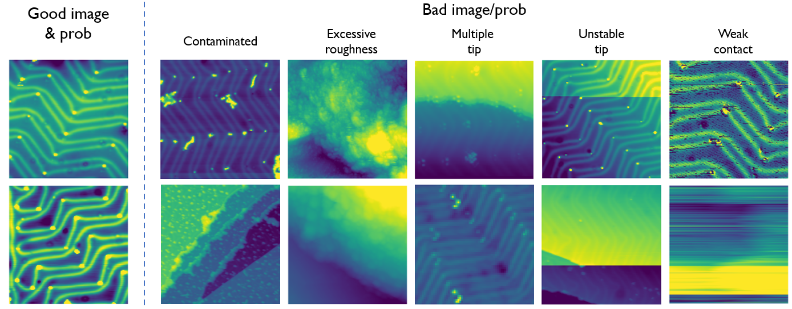

# AutoSPM

AutoSPM is a artificial intelligence framework for automated Scanning Probe Microscopy (SPM). This repository currently contains a CNN image classifier for detecting Au(111) herringbone stucture. The CNN architecture can also be used for detect other SPM images by fine-tuning the model.

Image examples:

